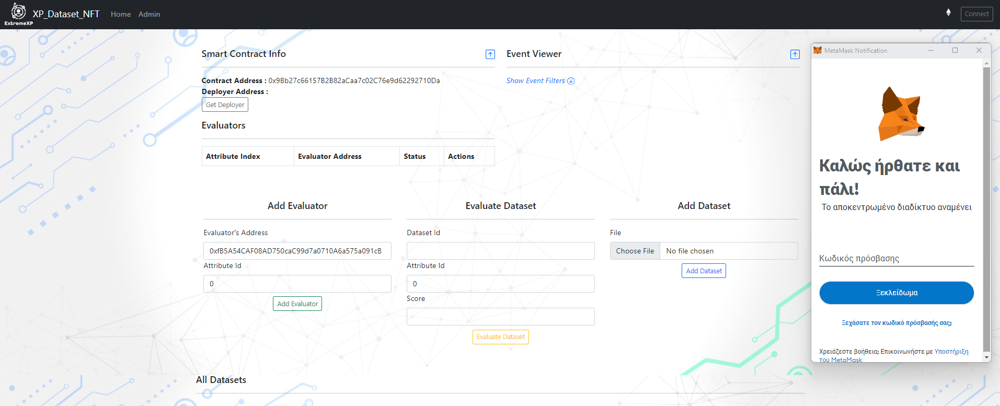
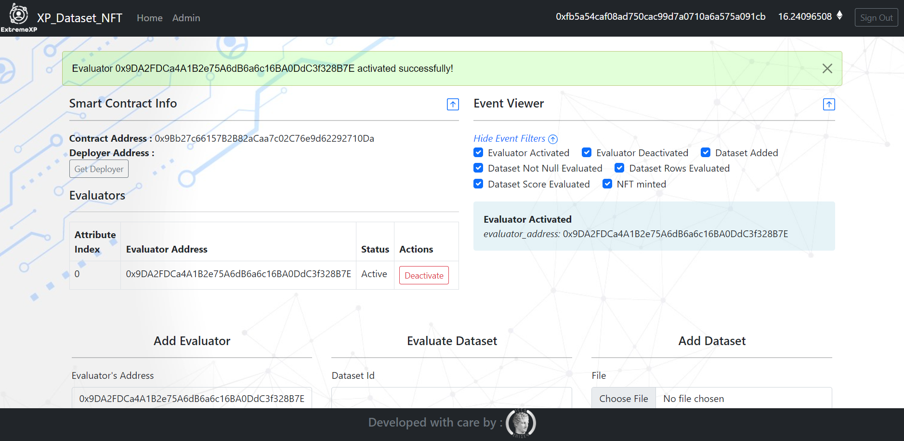
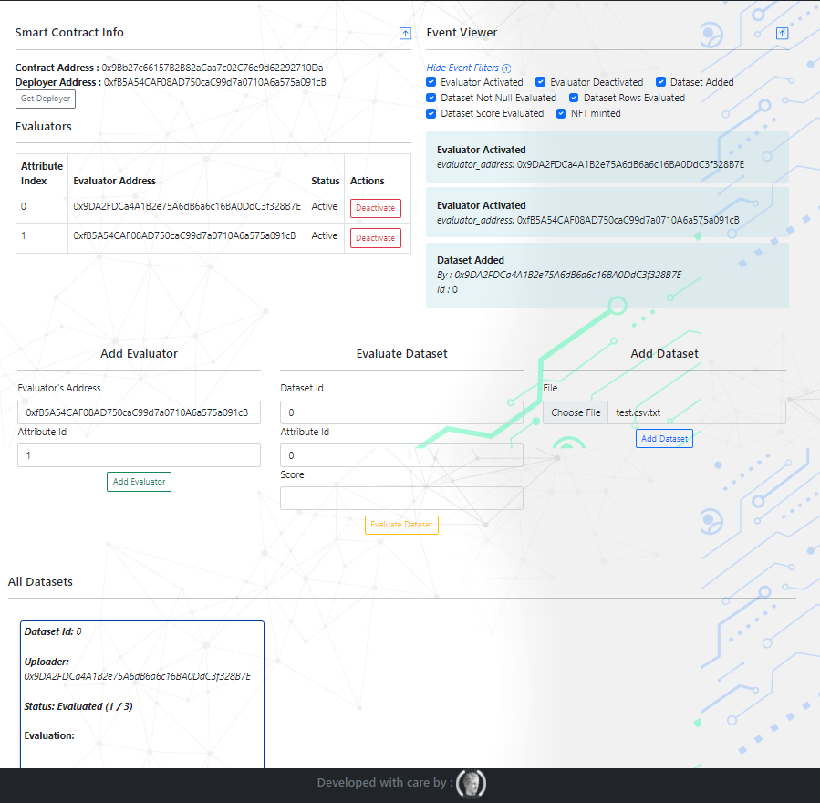

# NFT Provenance Demo App

A decentralized application for creating and managing dataset NFTs.


## Overview

Here are some screenshots of the application:

<div style="text-align: center;">
  
  
</div>



### Video Demo

Watch the demo of the NFT Provenance app:
<div style="text-align: center;">
  <video width="800" controls>
    <source src="static/nft_poc_video.mp4" type="video/mp4">
    Your browser does not support the video tag.
  </video>
</div>

### Features

- **Create NFTs**: Mint unique tokens to represent your digital assets.
- **User Profiles**: Showcase your collection and activity on the platform.

### Installation

#### Prerequisites
- Python and pip
- Node.js and npm
- A local Ethereum blockchain (e.g., Ganache)
- a client eth wallet (e.g. metamask)

#### Getting Started

1. **Clone the repository:**

   ```bash
   git clone https://github.com/IMU-ICCS/nft_based_provenance.git
   cd nft_based_provenance
    ```

2. **Install the dependencies:**
    ```bash
   pip install .\requirements.txt           
    ```bash
   npm install
   Start your local blockchain (if using Ganache) and ensure you have some test Ether.

3. **Set up the environment:**

   Create a .env file in the root directory and add your configuration settings.
   
   Run the application:
   
    ```bash
   
   npm start
